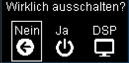

# RasPi-OLED-Menu

This code is for a homemade internet radio.
It is based on a Raspberry Pi Zero W with a USB sound card.
Only controllable via a web interface was no option for me, so I added a small OLED display and a rotary encoder.
There is a menu to navigate through with the rotary encoder.
The controller chip of the little oled is the sh1106. (I bought it from ebay)
An ADS1115 with a potentiometer is used to control the ALSA volume.

It connects to Mopidy for music playback and webradio stations and to shairport-sync for airplay status information and automatic pausing of MPD.

## Windows/Usage
Some screenshots from the different menu windows (sometimes the font is a bit off because of the simulator):
| Now playing | Connection lost | Main Menu |
| ----------- | --------------- | --------- |
|  |  |  |

| Radio stations | Playlist selection menu | Shutdown menu |
| -------------- | ----------------------- | ------------- |
|  |  |  |

When the software is started, it shows a loading screen until it gets a connection to MPD. If the connection is lost while active, it shows a little icon on the idle screen.
If shairport-sync is installed on the system, MPD will be paused when an AirPlay connection is established and the screen will show now playing information. You can also skip the current track or go back to the previous track using the rotary encoder controls.


## Installation
The code is provided without further warranty or support. There is no guarantee that it will work properly, since I am not a professional developer and only develop this project in my spare time.
1. Install [Raspberry Pi OS (Lite)](https://www.raspberrypi.org/downloads/raspberry-pi-os/) to your SD Card and set it up (there are lots of great guides online)
2. Install Mopidy/MPD and [configure it to create a playlist of radio stations](#mopidy-configuration).
3. Optional: Install Shairport-Sync and [enable the metadata pipe](#shairport-configuration).
4. Install some prerequisites: ``` sudo apt-get install python3-dev python3-pip libfreetype6-dev build-essential libopenjp2-7 libtiff5```
5. Download the code: ``` git clone https://github.com/techdiem/RasPi-OLED-Menu.git oledctrl && cd ./oledctrl```
6. Install python requirements: ``` pip3 install -r requirements.txt ``` (It might be necessary to install Kivy manually first)
7. Move the systemd config to the correct folder: ``` sudo mv oled.service /etc/systemd/system/ ```
8. Reload systemd: ``` sudo systemctl daemon-reload ```
9. Switch to the main code folder: ``` cd ./oled ```
10. Move font files to the ```fonts``` directory, they aren't included due to their copyright. [instructions](oled/fonts/README.md)
11. Copy the config file ``` cp settings.example.py settings.py ```
12. Set the pinout and other configuration values with ``` nano settings.py ```

Start it using ``` python3 oled.py ``` for debug and using ``` sudo systemctl start oled.service ``` for production.
To start on system boot, use ``` sudo systemctl enable oled.service ```.

## Configuration notes
### Mopidy configuration
For using the radio station menu, you need to tell mopidy a path to create playlist files. The [Mopidy-MusicBox-Webclient](https://mopidy.com/ext/musicbox-webclient/) has a streams tab which saves the stations to a playlist file called `[Radio stations].m3u8`.
In the mopidy configuration (`/etc/mopidy/mopidy.conf`) configure the m3u component:
```
[m3u]
enabled = true
base_dir =
default_encoding = latin-1
default_extension = .m3u8
playlists_dir = /music/playlists
```
Enter the same folder here as in the [settings.py](oled/settings.example.py) of this control software.
Make sure, that the user running mopidy has read/write access to this directory!
Now streams added by the MusicBox-Webclient are shown in the radio menu.

### Shairport configuration
You need to enable the shairport metadata pipe. To do so, edit your `/etc/shairport-sync.conf` file and uncomment/edit the following options:
```
metadata =
{
    enabled = "yes";
	pipe_name = "/tmp/shairport-sync-metadata";
	pipe_timeout = 5000;
};
```
Now there should be now playing information on the screen if you connect via AirPlay.
