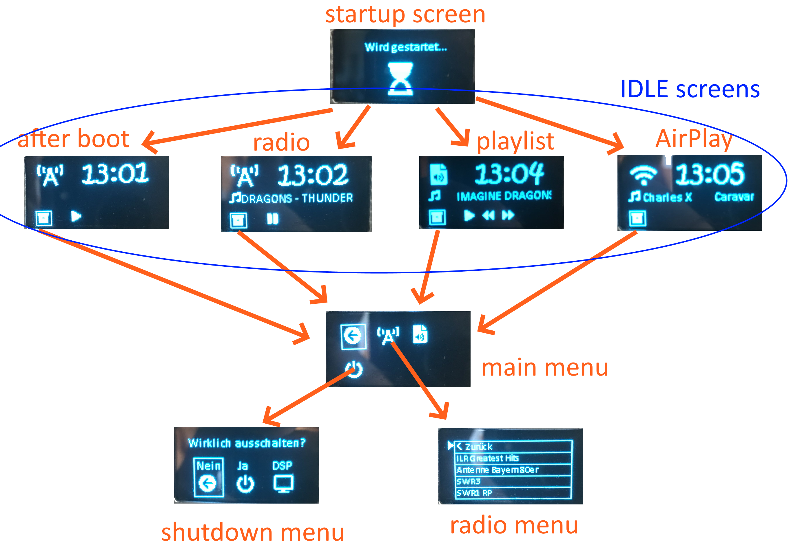

# RasPi-OLED-Menu

## My use
This code is for a homemade internet radio.
It is based on a Raspberry Pi Zero W with a USB sound card.
Only controllable via a web interface was no option for me, so I added a small OLED display and a rotary encoder.
There should be a menu to navigate through with the rotary encoder.
The controller chip of the little oled is the sh1106. (I bought it from ebay)

## Usage
Here is a graphic that shows the different screens:


## Installation
The code is based on the luma.oled library.
To install it, just follow the instruction [in the luma.oled documentation](https://luma-oled.readthedocs.io/en/latest/install.html). This example is written in python3, so please use python3, pip3 and so on.
Move font files to the ```fonts``` directory, they aren't included due to their copyright. [instructions](fonts/README.md)

To use it, connect your display (there are lots of guides online), and start it using ``` python3 oled.py ```
