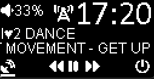
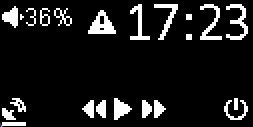
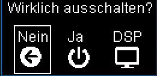
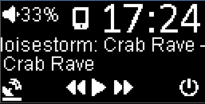

# RasPi-OLED-Menu

This code is for a homemade internet radio.
It is based on a Raspberry Pi Zero W with a USB sound card.

## Features
- Show currently playing title information
- Rotary encoder to navigate menu on an sh1106 oled screen
- Connect to MPD to play webradio stations
- Receive AirPlay via Shairport-Sync with automatic pausing of MPD when connecting
- ALSA Volume control with a potentiometer connected to an ADS1115 ADC
- Connect to MQTT broker for volume control
- FastAPI REST-API and webui to see now playing info and edit saved webradio stations

## Windows/Usage
Some screenshots from the different menu windows (sometimes the font is a bit off because of the simulator):
| Now playing | Connection lost | Shutdown menu |
| ----------- | --------------- | --------- |
|  |  |  |

| Radio stations | AirPlay playing |
| -------------- | ----------------------- |
|  |  |

When the software is started, it shows a loading screen until it gets a connection to MPD. If the connection is lost while active, it shows a little icon on the idle screen.
MPD will be paused when an AirPlay connection is established and the screen will show now playing information.


## Installation
The code is provided without further warranty or support. There is no guarantee that it will work properly, since I am not a professional developer and only develop this project in my spare time.

I'm running Alpine Linux (3.23) on the radio to reduce the memory footprint and boot time of the device.
- Install [Alpine Linux](https://alpinelinux.org/downloads/) to your SD Card and set it up, also enable the community-repo `setup-apkrepos -c`
- Update package cache: `apk update`
- Install alsa audio system, mpd, mpc, shairport-sync and tools: `apk add alsa-utils alsa-utils-doc alsa-lib alsaconf alsa-ucm-conf nano git mpd mpc shairport-sync git nano`
- Enable shairport metadata bridge like [shown below](#shairport-configuration)
- Add root to audio group and enable services: `addgroup root audio && rc-service alsa start && rc-update add alsa && rc-service mpd start && rc-update add mpd`
- Edit MPD config to load radio stations playlist, [see below](#mpd-configuration)
- Download this project: `git clone https://github.com/techdiem/RasPi-OLED-Menu.git /opt/oledctrl && cd /opt/oledctrl`
- Install python and dependencies: `apk add python3 py3-pip py3-pyalsaaudio py3-pillow py3-gpiozero py3-fastapi py3-cbor2`
- Create and activate venv: `python3 -m venv --system-site-packages /opt/oledctrl/venv`
- In `/etc/pip.conf` add this to download prebuilt wheels for the raspberry:
```
[global]
extra-index-url=https://www.piwheels.org/simple
```
- Install pip dependencies: `venv/bin/pip3 install -r requirements.txt`
- Copy init system file: `cp oled-openrc /etc/init.d/oled`
- Switch to the main code folder: ``` cd oled ```
- Move font files to the ```fonts``` directory, they aren't included due to their copyright. [instructions](oled/fonts/README.md)
- Copy the config file ``` cp settings.example.py settings.py ```
- Set the pinout and other configuration values with ``` nano settings.py ```

Start it using ``` python3 oled.py ``` for debug and using ``` rc-service oled start ``` for production.
To start on system boot, use ``` rc-update enable oled ```.

## Configuration notes
### MPD configuration
The following options should be configured at minimal:
```
playlist_directory	"/var/lib/mpd/playlists"
log_file			"/var/log/mpd/mpd.log"
pid_file			"/run/mpd/pid"
user				"mpd"

audio_output {
	type			"alsa"
	name			"USB Soundcard"
	device			"default"
	mixer_control	"Speaker"
}
```

Enter the same folder for playlist_directory as in the [settings.py](oled/settings.example.py) of this software.
Additionally, the device and mixer_control should match the ALSA config options in settings.py for the volume control to work seamlessly from both sides.

### Shairport configuration
The Shairport-Sync configuration is located at `/etc/shairport-sync.conf`.

Set the following entries for volume control to be synced to the iDevice, the config should match the ALSA configuration in settings.py:
```
output_backend = "alsa";
ignore_volume_control = "yes";

alsa =
{
	output_device = "default";
//	mixer_control_name = "Speaker";
};
```
Here, mixer_control_name is commented, because "Speaker" is the default, but you might need to change that.

Second, you need to enable the shairport metadata pipe. To do so,  uncomment/edit the following options:
```
metadata =
{
    enabled = "yes";
	pipe_name = "/tmp/shairport-sync-metadata";
	pipe_timeout = 5000;
};
```
Now there should be now playing information on the screen if you connect via AirPlay.
